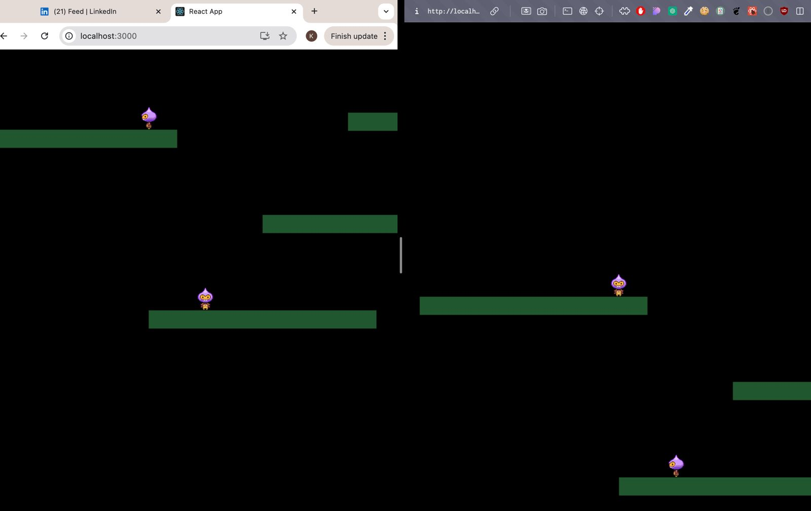

# 2d METAVERSE GAME 
users can  make video call to  each other and  can move here and there on the gaming environment 

# Gaming Environement

# if user at distance of 50 it can make a video call to other user 

# techstack used 
  react  
  express  
  WebRTC  
  WebSocket

# RUN the APP 

``
 cd game/game && npm i 
``

``
 npm start
``

# start websocket server 

``
 cd websocketserver
``

``
  npm i && npm run dev
``

